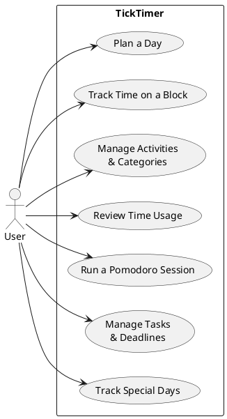

# Use-Case Model — TickTimer

*Unified Process artifact · 02 · Construction update — reflects the shipped v11 app*

## Revision History

| Version | Date | Description | Author |
|---|---|---|---|
| Inception draft | 2026-07-03 | First draft; UC1 and UC2 detailed, rest brief. | Mentor + you |
| Construction update | 2026-07-04 | Renamed **TickTimer**; added UC6 (Tasks & Deadlines) and UC7 (Special Days); UC3 extended with folders. | Mentor + you |

## 1. Introduction

This model lists the **actors** and the **use cases** — the goal-oriented ways the user uses the system. It is written in an **essential, UI-free style** (Larman, *Applying UML and Patterns*, ch. 6): each step states *what* the actor and system are trying to achieve, never the on-screen *how*. Non-functional requirements live in the **Supplementary Specification (03)**.

## 2. Actors

- **User** *(primary actor)* — the person planning and tracking their own time. Initiates every use case.
- **Sync service** *(supporting actor — future)* — an external service the app will exchange data with once cross-device sync exists. Out of scope for the first release (see Risk List, 05).

## 3. Use Cases — Summary

| ID | Use Case | User's goal |
|---|---|---|
| UC1 | Plan a Day | Lay out what I intend to do, and when |
| UC2 | Track Time on a Block | Measure my real focus vs. break within a plan |
| UC3 | Manage Activities & Categories | Keep reusable activities, grouped by life-area |
| UC4 | Review Time Usage | See where my time actually went (day / week / month) |
| UC5 | Run a Pomodoro Session | Work in timed focus / break cycles |
| UC6 | Manage Tasks & Deadlines | Keep one-off obligations and see what's due |
| UC7 | Track Special Days | Count down to birthdays, holidays, vacations |

## 4. Use Case Diagram

## 5. Detailed Use Cases

### UC1 — Plan a Day  *(fully dressed)*

- **Primary actor:** User
- **Level:** User goal
- **Preconditions:** At least one activity is available to plan.
- **Success guarantee:** The intended activity is recorded on the chosen day at the chosen time.
- **Main success scenario:**
  1. User chooses a day and a time to plan.
  2. User indicates the activity they intend to do and how long it will take.
  3. System records the planned block and shows it on that day's schedule.
  4. User repeats steps 1–3 until the day is planned.
- **Extensions:**
  - *2a.* The desired activity does not exist yet → User creates it (UC3), then continues.
  - *3a.* The chosen time is already occupied → System declines and indicates the conflict; User selects another time.
  - *\*a (at any time).* User reschedules a planned block to a different time → System moves the **plan** only; any time already tracked against it is left unchanged.

### UC2 — Track Time on a Block  *(casual)*

- **Primary actor:** User
- **Preconditions:** A planned block exists for the work at hand.
- **Main success scenario:**
  1. User begins focusing on a planned block; System starts recording focused time.
  2. When the user pauses, User switches to a break; System ends the focus interval and begins recording break time.
  3. User resumes focus, or stops; System records each interval with its real start and end.
  4. System keeps the **plan** and the **recorded intervals** separate, so planned vs. actual can be compared later.
- **Extensions:**
  - *3a.* The application closes mid-interval → on reopening, System reconstructs elapsed time from the stored timestamps; nothing is lost.

## 6. Brief Use Cases

- **UC3 — Manage Activities & Categories.** User creates, edits, or removes activities and the categories (life-areas) that group them, and organises categories into **folders** (one level deep). Changes are immediately available when planning. Constraint: an activity in use by a plan cannot simply vanish (see Supplementary Specification for the integrity rule).
- **UC4 — Review Time Usage.** User selects a period (day, week, or month); System summarises time by category and focus-vs-break, **derived** from the recorded intervals (never stored as separate totals).
- **UC6 — Manage Tasks & Deadlines.** User records one-off obligations (tasks) under a life-area, optionally with a due date — "date to be decided" is a first-class state; marks them done. System presents every dated, unfinished task as **upcoming deadlines**, grouped by urgency and **derived on demand**, never stored. Constraint: a category holding tasks cannot be deleted (Supplementary Specification).
- **UC7 — Track Special Days.** User records dates that matter on their own (birthdays, holidays, vacation starts), optionally repeating yearly. System shows each with a countdown to its **next occurrence** — derived, never stored.
- **UC5 — Run a Pomodoro Session.** User starts a focus/break cycle; System counts down each phase and advances through the cycle, with a longer break after a set number of focus rounds.

---

*Notes: Essential, UI-free style throughout — steps say "indicates the activity," never "clicks Add." Only UC1 and UC2 are written in detail, because they carry the app's core idea (plan vs. actual); the rest stay brief, per the UP's guidance to detail only the architecturally significant use cases during inception.*
