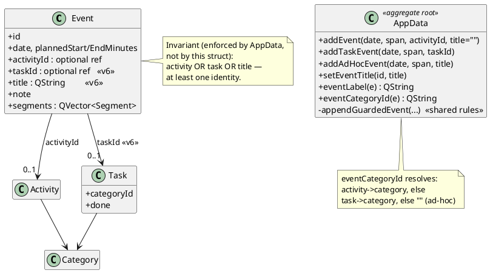

# Design Addendum — Block Identity: Labels, Task Blocks, Ad-hoc Blocks

**Status: implemented.** Continues the decision log in `design-doc.md §3`.
Records the "what am I doing during this block?" run: custom labels painted on
blocks, planning a Task directly as a block, and spontaneous (ad-hoc) blocks
that belong to no activity. Merging into `design-doc.md` remains follow-up
work, alongside the two earlier unmerged addenda.

**The requirement, in the owner's words:** *"I'd like a description that when I
type it, it appears on the block on the agenda — that way I know what I'm doing
during that block. I'd like to add a task from the activity [picker]. And
sometimes a planned block isn't an activity — it's something spontaneous."*

---

## 3.25 One Event, three identities — generalize, don't multiply

*Decision:* `Event` stays the app's single "a plan occupying a time range"
type. It grows two **optional** fields — `taskId` and `title` — and
`activityId` becomes optional too. The domain invariant is now:

> **An Event must have at least one identity** — a real Activity, a real Task,
> or a non-empty title.

*Alternative rejected:* three event types (`ActivityEvent`, `TaskEvent`,
`AdHocEvent`). Every consumer of events — the agenda, the week view, stats,
storage, the tracker — treats them identically *as time ranges*; only naming
and colouring differ. A class hierarchy would force every one of those
consumers through virtual dispatch to answer two string-sized questions.
Two optional fields plus two resolution helpers is the whole difference.

*Where the invariant lives:* **not** in the `Event` struct (a plain struct
cannot defend a rule spanning three fields without becoming a class), but at
`AppData`'s doors — the same "one door" placement as every other rule.

## 3.26 Three named creation doors, one guarded worker

*Decision:* creation is `addEvent(…, activityId, title)`,
`addTaskEvent(…, taskId)`, and `addAdHocEvent(…, title)` — three public
signatures sharing one private `appendGuardedEvent` that owns the time-range
rules (valid date, `isFree`).

*Why three doors instead of one `addEvent(activityId, taskId, title)`:* with
one door, a caller could pass both a task **and** an activity, or neither —
and the function would have to detect and refuse nonsense at runtime. With
three doors, the nonsense call **does not compile-time exist**: no signature
accepts it. Each door verifies exactly its own identity (`activityById`,
`taskById`, non-empty trimmed title) and delegates the shared rules. This is
"make illegal states unrepresentable" applied to an API instead of a type.

*Mutation follow-ups:* `setEventTitle` trims, and **refuses** clearing the
title of an ad-hoc event — that would strip the block's last identity.
Refuse, not clamp: same contract as `resizeEvent`.

## 3.27 Deleting a task: refuse, cascade… or **downgrade**

*Decision:* `removeTask` no longer just erases — it first **demotes** every
referencing event's link to text: the task's title is copied into the event's
`title` (unless the user already typed their own label), then `taskId` is
cleared.

*Why not refuse (like `removeActivity`):* an Activity is a reusable type; a
block pointing at it is meaningless without it, so refusal is right. A Task is
a one-off; you finish it, you delete it — blocking deletion because last
Tuesday's calendar mentions it would make cleanup impossible.

*Why not leave the dangling id:* the block would paint "(missing)" forever.
The downgrade keeps the model referentially clean **and** keeps the plan's
meaning — a third option worth remembering between "refuse" and "cascade".

*A lifetime lesson caught during implementation:* `taskById()` returns a
pointer **into** `m_tasks`; `erase()` invalidates it. The title must be copied
to a value **before** the erase. (Exactly the danger the lookup comment in
`AppData.h` warns about.)

## 3.28 Resolution helpers — one rule for "what is this block?"

*Decision:* two `AppData` queries answer identity questions for every screen:

- `eventLabel(e)` → activity name, else linked task's title, else the ad-hoc
  title, else `"(missing)"`.
- `eventCategoryId(e)` → the activity's category, else the **task's** category
  (tasks carry one directly, §3.10), else `""`.

`AgendaWidget`, `EventDialog`, `Stats`, and `GlancePanel` all resolve through
these — before this change three of them each walked
`Event → Activity → Category` themselves, and a new identity kind would have
meant three parallel edits.

*Documented limitation:* an ad-hoc block has no life area. Its tracked time
counts in day/week totals but appears in **no** per-category bar. Pinned by a
test so it cannot drift silently; the honest fix later is an explicit "Other"
bar, not a hidden default category.

*Storage:* two additive keys (`taskId`, `title`) on the event object; tolerant
read (missing key → `""` → an activity-only event, exactly as before). Format
version **5 → 6**. Third additive bump; still zero migration code.

*UI notes:*
- **Picker** (`PickActivityDialog`) now returns a *tagged result* —
  `Kind { Activity, Task, AdHoc }` plus the matching id/text — instead of a
  lone activity id. The list shows open tasks under each life area (rail
  order, done tasks omitted: you don't plan finished work). One text field
  serves two intents: *type + click an activity* = labelled activity block;
  *type + Enter* = ad-hoc block. One field, because the user shouldn't have
  to classify their intent before typing.
- **Painting:** line 1 = `eventLabel` (bold, elided; "✓ " prefix when the
  linked task is done). Line 2 (≥2 slots) = the time range — the block's
  fixed anatomy, same position on every block (owner request: name, time,
  THEN the text). Line 3 (≥3 slots) = the custom label / linked-task
  subtitle. Accepted consequence: 1-hour blocks show name + time only; the
  description needs a 1.5h+ block. Ad-hoc blocks paint neutral grey —
  visibly outside your named life areas, which is the truth.
- **EventDialog** gains a one-line label field. It commits on
  `editingFinished`, not per keystroke: the domain may refuse (ad-hoc + empty)
  and refusing mid-typing would fight the user. Validate-on-commit; the field
  snaps back if the domain says no.

## 3.29 Linking a task to an EXISTING block (follow-up, owner request)

*The ask:* the picker planned *new* task blocks, but the owner wanted to
attach a task from the **label field of a block that already exists** —
"Study GTI350, working on Lab 4."

*Decision:* a block may hold an activity **and** a task. The activity stays
the identity (name on line 1, life-area colour, stats attribution — pinned by
test with the task deliberately in a *different* category); the task becomes
the **subtitle** ("what you're doing inside it"), with the ✓ moving to
whichever line shows the task. One new door: `setEventTask(id, taskId)` —
link must resolve, unlink refused when the task is the last identity (the
mirror of `setEventTitle`'s guard). No JSON change: `taskId` already persists.

*UI (grown again — owner request "a bigger box"):* the label field is now a
**multiline** `QPlainTextEdit` (~3 lines; `LabelEdit` in EventDialog.cpp).
Two contracts changed with it: (1) `QCompleter` no longer attaches for free —
`LabelEdit` implements Qt's documented custom-completer pattern
(`setWidget` + `keyPressEvent` driving the popup; popup keys ignored by the
edit so Enter selects instead of newlining); (2) there is **no
`editingFinished`** on a multiline edit — Enter means "new line" — so the
label commits **on focus-out** via a callback, with a `PopupFocusReason`
guard so choosing a completion doesn't count as "done editing". On the
agenda, the description now paints **word-wrapped** into the block's
remaining height (clipped, not elided — Qt can't elide wrapped text, and a
clean clip beats "…" mid-paragraph): resize the block, see more. Both
halves of the save contract are pinned by a UI test
(`blockLabelIsMultilineAndCommitsOnFocusOut`).

The original completer wiring, for the record: the label field gets a
`QCompleter` over open tasks
(`MatchContains`, case-insensitive — "lab" finds "Lab 4"). **Activating a
completion links; plain text stays a label** — the same next-gesture
disambiguation as the picker's one field. A "Linked task: … / Unlink" row
shows the state; Unlink is disabled when the domain would refuse. **Revised (owner request — "I can only put one or the other"):** linking
NO LONGER clears the label. Original design treated the label as "what shows
on the block" and made the task replace it; in practice the label became the
block's comments, and linking silently destroyed them. Now the two are
independent facts — task = structured "what", label = free-text "and also" —
and the block paints BOTH (task line, then comments word-wrapped in the
remaining height). On link, the box just snaps back to the stored label: the
typed text was a search query, never committed (the popup guard in
focusOutEvent is what kept it uncommitted). The old "link before clear"
ordering lesson stands as a principle — intermediate states must satisfy the
invariant — but the clear itself is gone.

*Alternative rejected:* magic string-matching on `editingFinished` (typed
text that happens to equal a task title auto-links). Too surprising — an
explicit completer activation is a visible, deliberate gesture; equal text
is not.

## 3.33 Task descriptions on blocks — a display preference (follow-up)

*The ask:* tasks carry a `description` (task-details addendum); show it on
the block too — indented under the task line — and let the user choose.

*Classification (the once-per-fact question):* "show descriptions?" changes
how blocks LOOK, not what is true → a **setting**, not domain data. It lives
in `QSettings` (`planner/showTaskNotes`), exactly like the Pomodoro
durations; `data.json` never learns about it. Default ON (the owner asked to
see them), unticking is remembered.

*Wiring:* a "Task notes" checkbox on the agenda panel's header row —
"Your day" left, toggle right, directly above the blocks it changes (moved
there from the top bar on owner request: controls near their effect need no
explanation; the top bar keeps only date navigation, ‹ Today › at the far
right). Known tradeoff: the toggle lives on the Day view but its effect
covers the week columns too. Only
`PlannerPage` touches QSettings; `AgendaWidget` gets a
`setShowTaskDescriptions(bool)` and is TOLD — a painter that reads app
configuration stops being reusable (day view, week columns, and the
screenshot tool share this widget). `WeekAgendaView` forwards one call to
its seven columns; the forwarder's body lives in the .cpp because the
header only forward-declares `AgendaWidget` (calling a member needs the
complete type — incomplete-type error caught at build).

*Paint:* the description is indented 12px (the eye reads it as belonging to
the task above), word-wrapped, and it advances the running y-offset by the
height it actually used — the comments start wherever it ends. Block reads:
name / time / task / *description* / comments.

*Field note:* verifying the OFF state required knowing where QSettings
reads — the layout probe now prints `QSettings().fileName()` instead of
anyone guessing platform paths. With only an application name set, Qt files
preferences under **"Unknown Organization"**; deliberately left alone,
because setting an organization name now would RELOCATE both the settings
and `QStandardPaths` data folder — existing Pomodoro durations and
`data.json` would appear to vanish (see main.cpp's naming comment).

## 3.34 Column flow — the empty right half carries the overflow

*The problem (owner-spotted):* descriptions written as lists carry HARD line
breaks ("analyse des tâches ;\nprototypes ;\n…") — short lines that word
wrap can never widen. The right half of the block sat empty while the bottom
clipped: space wasted and content lost, simultaneously.

*Decision:* newspaper flow, via a shared paint helper (`drawFlowedText`).
If the text fits the area at full width, it draws exactly as before —
columns only appear when they earn something. On overflow it re-flows into
two **balanced** half-width columns (line count split evenly, not
column-1-stuffed-full: even columns read as one text; a full-left/stub-right
pair reads as two). Block height stays the final budget — two full columns
still clip.

*Why `QTextLayout`, not `drawText`:* `drawText` wraps but positions every
line itself; flowing to a second column requires LINE-BY-LINE placement,
which is `QTextLayout`'s whole job (`createLine` hands you each line, you
set its position). One prerequisite trick: `QTextLayout` treats its text as
a single paragraph and ignores '\n', but honors **`QChar::LineSeparator`**
(U+2028) as a forced break — so newlines are swapped before layout.

*Mechanics worth remembering:* `setLineWidth` on each line is not optional
decoration — the layout needs it to know where THIS line ended before it can
create the next. Uniform line height (one font, no rich text) reduces all
measuring to line-counting: a counting pass answers "does it fit?", a
positioning pass places lines with a column hop when one fills.

Applies to both the task description and the block comments; each returns
its consumed height so content below stacks correctly.

**Second iteration (owner-found flaw):** the original trigger — "columnize
only when the text overflows its own area" — was a SELFISH fit test. A
description that technically fit would hog one tall column and starve the
comments underneath, right next to an empty right half (font-metric
dependent: the owner's Windows fonts hit it, the Linux test box scraped by
until the description grew a line). The trigger is now a **budget**: each
text may consume its area MINUS a reservation for the neighbor below (the
comments' measured single-column height, capped at half the area so a huge
comment can't erase the description either). Exceed the budget →
columnize, even though the area had room. The §3.34 rule generalizes
cleanly: *columns appear when they earn something — and making room for the
neighbor counts as earning.* Tall empty blocks still get single-column
text; nothing gratuitous.

## 3.36 Ad-hoc titles: first line is the headline, the rest is the body

*The bug (owner-reported):* two features collided. Multiline labels (§3.33,
built as block COMMENTS) met ad-hoc blocks (§3.26, where the label IS the
identity) — so `eventLabel` returned an entire paragraph, and every screen
that asks "what is this block called?" rendered it: a paragraph-sized bold
header in the dialog, agenda line 1 bleeding into the time line.

*Decision:* the rule the owner was already writing by — **first line =
title, everything after = description.** `eventLabel` returns only the
first line of an ad-hoc title; a new sibling resolver `eventBody` returns
the remainder (and, for activity/task blocks, the whole title — the split
applies only where the doubling existed). ONE stored field, TWO derived
views: no new domain field, no format bump, old files load unchanged —
derive-don't-store again.

*Why it was cheap:* §3.27 put resolution in one place. The dialog header,
agenda, and week columns all call `eventLabel` — one edit corrected every
screen simultaneously; only the agenda's comment painting needed to switch
from raw `e->title` to `eventBody` (else the headline printed twice).

*Rejected:* a separate title field + description field for ad-hoc blocks —
a schema change, extra dialog UI, and the user would re-type what their
first line already says.

## 3.39 Short blocks: the description moves BESIDE the task line

*The owner's question, verbatim:* "since the time slot isn't long enough to
display it, [the intent] is to see it on the right column, right?" — asked
of a 1h30 block whose description only appeared after stretching the block
to 2h. The honest answer was *no, but it should be*: §3.34's columns only
subdivide the description's own area BELOW the header lines, and on a
3-slot block that area is about one line tall — two columns of zero rows is
still zero. Meanwhile the right half beside the task line sat empty.

*Decision — a placement rule, not more columns:*

- **Roomy block** → unchanged: description indented below the task line,
  budget-aware (§3.34).
- **Tight block** → the task line keeps the LEFT half (elided), and the
  description flows in the RIGHT half, anchored at the task line's own row,
  down to the plan-vs-actual bar. Comments, if any, take the left half
  beneath. `drawFlowedText` gained `maxColumns` for this: the side region
  wraps and clips but never sub-columnizes (half a block cannot afford
  quarter-width slivers).
- **The trigger is geometric** — "fewer than two line-heights would remain
  below" — deliberately NOT a does-the-text-fit measurement. Fit tests
  wobble between font stacks (the §3.34 budget bug bit Windows and spared
  Linux); a threshold expressed in line-heights makes both platforms give
  the same verdict on the same block.
- Placement is decided BEFORE the task line is drawn, because the answer
  changes the task line's width — layout decisions flow top-down even when
  the *reason* lives further down the block.

*Scope:* applies to blocks with a task line. Task-identity blocks never
spent a row on one, so their description keeps fitting below unchanged.

---

## Class diagram (delta)

## What changed where

| Layer | File(s) | Change |
|---|---|---|
| Domain | `Event.h` | `taskId`, `title` fields |
| Domain | `AppData.h/.cpp` | 3 creation doors + shared worker; `setEventTitle`; `eventLabel` / `eventCategoryId`; `removeTask` downgrade |
| Storage | `JsonStore.cpp` | 2 additive keys; version 6 |
| Stats | `Stats.cpp`, `GlancePanel.cpp` | attribute via `eventCategoryId` |
| UI | `PickActivityDialog.h/.cpp` | tasks in the list; text field; tagged result |
| UI | `PlannerPage.cpp` | routes the three kinds to the three doors |
| UI | `AgendaWidget.cpp` | label line, subtitle line, ✓ prefix, eliding, neutral ad-hoc colour |
| UI | `EventDialog.h/.cpp` | label field (validate-on-commit); identity via resolvers |
| Tests | `test_domain.cpp` | +8 (25 → 33): doors, invariant, downgrade, attribution, JSON round-trip, link/unlink guards |
| Domain (§3.29) | `AppData.h/.cpp` | `setEventTask` |
| UI (§3.29) | `EventDialog`, `AgendaWidget` | task completer + link row; linked task as subtitle |
