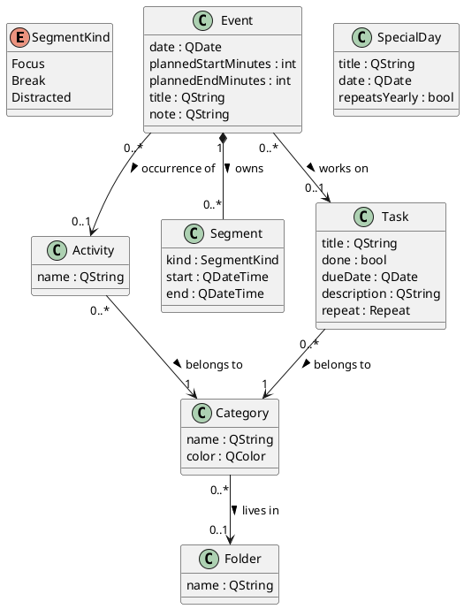

# TickTimer — Design Document

*Status: **v6.** Read this document knowing which parts move at which speed. §1–§4 (overview, domain model, core decisions, persistence) describe the app as it stands. **§3's addendum index is the live decision log and is current through v29.1**; the addenda themselves are standalone files, kept as records of the sessions that produced them, not drafts awaiting merge — the first two are the exception, merged below as §3.9–§3.14. Two of them (`login`, `sync`) mark a turn: TickTimer grew from a purely local desktop app into a **client + self-hosted server** pair. **§5's inventory is a v15–v19 snapshot** and is deliberately not rewritten per release — its version and test numbers are historical, not current; the index is where the truth lives. Formerly "Time & Focus Tracker."*
*Last updated: 2026-08-17 — persistence format (§4) corrected to v13 and its v11–v13 history restored; status re-scoped after §5's stale figures were mistaken for current ones.*

---

## 1. Overview

**What it is.** A desktop application (C++17 / Qt 6) that tracks how you spend the hours of your day on a daily calendar, then shows you where your time actually goes — across work, health, social life, rest, and the time lost to anxiety-driven procrastination. Around that core it keeps your one-off **tasks** (with due dates and an Upcoming view), your life areas organised into **folders**, and the **special days** you're counting down to.

**Who it's for.** A single user (you). No accounts, no multi-user, no sync.

**Why it exists.** Two ideas drive the entire design:

1. **Plan vs. actual.** You plan the day by dropping activities onto the calendar, then track what *really* happened with a focus/break timer inside each block. The gap between the two is where procrastination hides.
2. **Productivity has many dimensions.** Time isn't simply "productive" or "wasted." The gym, friends, and family are valuable in *different areas of life*. The app credits them instead of shaming them.

## 2. Domain model

The shared vocabulary — the real-world concepts, described before any thought of windows or files (Larman, *Applying UML and Patterns*, ch. 9).

**The concepts** (full data-dictionary detail in the Glossary, 04):

- **Category** — a *life area* (Work/Study, Health, …); optionally lives in one **Folder**.
- **Folder** — a named grouping of Categories in the rail; one level deep.
- **Activity** — a reusable *type* of thing you do; belongs to one Category. Never "done."
- **Event** — a block on the calendar: your *intention*. Its identity is any mix of an **Activity** (an occurrence), a linked **Task** (a work block), and/or a free-text **title** (an ad-hoc block; doubles as the block's comments) — the domain refuses to strip the last identity (§3.25–§3.27). Owns its **Segments**.
- **Segment** — one stretch of *real tracked time* (Focus or Break) with real timestamps.
- **Task** — a one-off, *completable obligation* with an optional due date. Belongs to a Category directly.
- **SpecialDay** — a standalone date that matters (birthday, holiday); may repeat yearly.

The type-vs-instance family worth memorising: **Activity** is a reusable *type*; **Event** is a dated *plan* to do one; **Task** is a one-off *obligation* to finish something. Different lifecycles → different concepts. Since v14 an Event may reference an Activity, a Task, both, or neither (title-only); "at least one identity" is the invariant, enforced at the mutation doors rather than in the struct (§3.25).

**Planned times are minutes, not QTime.** Events store `plannedStartMinutes`/`plannedEndMinutes` as ints (minutes after midnight) because the last slot ends exactly at midnight — 1440 — which `QTime` cannot represent. The doc's original QTime sketch met reality and reality won; the intent (a planned time range) is unchanged.

**Deliberately *not* modeled** (derived, or belonging elsewhere): no `Day`, no `WeeklySummary`/`MonthlySummary`, no stored "upcoming" list, no stored "next occurrence" for special days, no timer-state classes. Every one of those is derived on demand (§3.5) or is runtime state (§3.8).

## 3. Key design decisions

Each is **choice → why → alternative rejected**.

**3.1 Half-hour planning slots, 6 AM–midnight.**
The day is planned in **30-minute slots** from 6 AM to midnight (36 slots); a block spans 1–4 slots (30 min–2 h).
*Why:* validated by the interactive prototype — the original hourly sketch proved too coarse in use. When a validated prototype and a document disagree, reality wins and the document is corrected (this correction, right here).
*Rejected:* hourly slots (too coarse); free-form intervals for *planning* (complexity without payoff at the planning stage).

**3.2 Plan vs. actual, kept separate (Event vs. Segment).**
*Why:* the gap between intention and reality is the whole point. **3.3** Planning is coarse; the timer measures to the second — easy entry where entry matters, truth where truth lives. **3.4 Reference, don't copy** (Event → Activity → Category; Task → Category; Category → Folder): one source of truth; rename or recolour once and everything follows. **3.5 Derive, don't store:** summaries, the Upcoming list, and special-day countdowns are computed from raw data whenever asked; a stored answer can drift and lie. **3.6** Category is a user-definable class, not an enum. **3.7** One Category per Activity (v1). **3.8** Timer state is a state field, not subclasses (Larman ch. 32).

**3.9 Task as its own class, not fields on Activity.** *(merged from addendum #1)*
*Why:* an Activity is a shared *type*; putting `done`/`dueDate` on it fails the two-way test of a domain model — *express every truth, forbid every falsehood*. One shared "Gym" cannot say "Lab 4 done, Lab 5 not," and marking it done would complete every gym block in history.
*Rejected:* `bool done; QDate dueDate;` on `Activity`.

**3.10 Task belongs to a Category directly.** "Lab 4" is not an occurrence of any reusable type. *Rejected:* Task → Activity indirection (forces fake activity types).

**3.11 Optional due date as an invalid QDate.** `!isValid()` **is** the "date TBD" state, first-class. *Rejected:* a parallel `hasDueDate` flag — a second source of truth waiting to disagree.

**3.12 Folder as a stored concept, not a name convention.** *(merged from addendum #2)*
*Why:* folder membership must survive a restart — it is a fact, and facts get concepts. *Rejected:* name-prefix folders ("School / LOG410") — a fact smuggled into a string; and nesting (complexity before need).

**3.13 Upcoming is a query, not a table.** `upcomingTasks()` — undone, dated, most urgent first — recomputed on every change. *Rejected:* persisting the grouped list (§3.5).

**3.14 Yearly special days; the Feb 29 rule.** The *next* occurrence is derived, never stored. A Feb 29 anniversary in a common year resolves to **Mar 1** — arbitrary, documented, decided at design time instead of discovered in production. *Rejected:* storing next-occurrence; vacation date *ranges* (deferred — enter a vacation by its first day).

**3.15–3.34 — the decision log continues in the addenda.** Same
choice → why → rejected format; each file is the record of the session that
produced it:

| Sections | Addendum | Topics |
|---|---|---|
| §3.15–§3.20 | `design-addendum-task-details.md` | Task `description`/`repeat`, `updateTask`, settings vs domain, the due strip, drag-and-drop |
| §3.21–§3.24, §3.35, §3.37–§3.40 | `design-addendum-agenda-and-tracking.md` | Upcoming as cards, week agenda (`AgendaWidget` ×7), drag-to-resize, *Distracted* time — tracked (§3.24) and then made visible everywhere (§3.35) |
| §3.25–§3.29, §3.33–§3.34, §3.36, §3.39 | `design-addendum-block-labels.md` | Event's three identities, task & ad-hoc blocks, linking a task to a block, multiline labels, task + comments coexisting, the task-notes toggle, column-flowed text |
| §3.30–§3.32 | `design-addendum-android.md` | compact mode by geometry, touch scrolling, the minimum-width probe |
| (window A–I) | `design-addendum-window-memory.md` | geometry as an opaque blob vs four ints, the unreachable-monitor guard (pure policy + impure adapter), caller-supplied defaults, write-on-intent + debounced write-on-motion (§E — the write-on-close tradeoff that lasted one night), the non-symmetric compact-screen skip, the 23:00 time-bomb test |
| (login A–F) | `design-addendum-login.md` | client/server split, own auth vs Google, salted+stretched passwords, QTcpServer, async client, the three-stacked networking bug |
| (sync A–H) | `design-addendum-sync.md` | full-document sync, the four-row decision table, session tokens, the opaque-blob server, conflict-as-human-choice |
| (accounts A–D) | `design-addendum-accounts.md` | per-account local files, sync-state namespacing, one-time data adoption of the old global planner |
| (share A–H) | `design-addendum-share.md` | directed read grants, 401 vs 403, path parameters, the client-side compare (one summarizer, two datasets), whole-blob privacy trade-off |
| (daily-driver A–H) | `design-addendum-daily-driver.md` | the open→done→archived life stages, priority as rank not reorder, honest tracking (facts editable by their owner), schedules in compare, editable special days — the first owner-feedback session |
| (repeat A–H) | `design-addendum-repeat.md` | the newest-link invariant (spawn-guard for free), completion vs calendar as metronome, no retroactive occurrences, skip-don't-fight, the borrowed-vocabulary debt, v9 migration by absence |
| (alarms A–F) | `design-addendum-block-alarms.md` | derive-don't-store applied to time (a re-aiming single-shot), the high-water mark + grace window, ids over text, the ctor-injection lesson |
| (pomodoro A–H) | `design-addendum-pomodoro.md` | the engine extraction (state as a service, views as faces), three signal grains, the link adapter's "you pick the block, the Pomodoro picks the kind", painted tray icon, the frameless always-on-top recipe |
| (settings A–I) | `design-addendum-settings.md` | display window vs domain grid, "data always wins", the union rule for multi-column alignment, week start as a pure-layer parameter, pinned identity headers |
| (settings-nav A–G) | `design-addendum-settings-nav.md` | Settings as shell + pages: the `SettingsPage` contract, one save() per page, why pages are built eagerly, and the last-page-memory idea rejected to protect "Cancel writes nothing" |
| (catch-up §0, A–K + 5 codas, §L) | `design-addendum-catch-up.md` | blocks that didn't happen: derived verdict vs stored decision, the reschedule ladder as a ranked list, propose-don't-move, and why the app never picks which block gets bumped |
| (update A–G) | `design-addendum-update.md` | the notify/download/self-install ladder (and why Level 1), version as single source of truth (the RC_INVOKED trick), strict semver, per-request version.json, the non-nag banner rule as a pure function |
| (quickadd A–I) | `design-addendum-quickadd.md` | natural-language capture: one pure parser, three surfaces (field, page, global bar), the grammar as decisions, AI as *fallback* behind the deterministic parse, the stale-reply guard |
| (provider A–J) | `design-addendum-provider.md` | the vendor as a value: Provider = base URL + dialect + model + key; two dialects cover the market; value + free functions over a strategy hierarchy (and when to revisit); the `QUrl::resolved()` trap; the QSettings value-vs-group silent write loss; per-provider keys with the stash/load edit buffer; Ollama and `needsKey=false`; the Version.h `static_assert` guard |
| (chat A–J) | `design-addendum-chat.md` | the read-only assistant: `brief::` (domain-pure day briefing with encoded anti-hallucination rules) + `chat::` (core-pure transcript, character-budget window, localOnly turns) meeting only in ChatPage; §C revisited — multi-turn stayed data, one-shot delegates to chatRequestBody; the fifth wire client and why it is not a mode on the fourth; rail order vs stack identity (the nav off-by-one); the untranslated system prompt |
| (subtasks A–O) | `design-addendum-subtasks.md` | Pieces as plain Tasks with `parentId` (link on the child), the five query policies that disagree on purpose (§D), completion never rolls up, the re-land record (§K), the piece's own panel + navigation-as-answer (§L, v28.5), pieces in the list — the §D *display* amendment, counting untouched (§M, v28.7), the size ladder with its cap-as-doctrine (§N, v28.8), and PROMOTION — a dated piece answers for itself and its minutes leave the parent, minutes believed exactly once (§O, v28.9) |
| (panel A–G) | `design-addendum-detail-panel.md` | One form, two containers (modal wrapper as fallback — the whole old suite passed unchanged); explicit save by owner decision (dirty-by-comparison, Save/Discard/Stay, Enter never discards); rebuild-not-reset + the deleteLater/queued pair; changed()-while-open rules; docked → OVERLAY (§G, v28.6.1): scrim, click-away through the same guard, the WA_StyledBackground trap |
| (assistant A–O) | `design-addendum-assistant.md` | **Roadmap — read-only arc SHIPPED through v28.4** (foundation v26; nudges, check-in & mood v28.0–2; subtasks split into its own addendum v28.3; the estimate multiplier v28.4); tool use (§K/§B intake-first) is the still-planned v29. The spine: the spine (*code decides when, code computes what is true, the model only phrases*); the trust boundary (proposal → guarded doors → your tap) and why **no undo button** is correct once every verb has an inverse; persona as a value with voice layered *under* the safety floors; reasoning-model handling; per-role provider routing as a **privacy boundary**; nudges, check-in and mood; `affordability()`; subtasks as their own domain iteration; the estimate multiplier TickTimer can compute because it has recorded the truth since v1; intake as the safest first write; the memory file's two rules; and the list of things we deliberately will **not** build |
| (needs-a-block A–H) | `design-addendum-needs-a-block.md` | deadline-aware coverage (`max(due, today)`), THE derived list, two independent `ReturnPolicy` clocks, escalation by specificity not volume, the gate as one derived line, the bounded scan, format v10 |
| (debug A–H) | `design-addendum-debug.md` | **v28.10** — "seams only tests can reach are half a seam": the Ctrl+Shift+D panel as pure glass (presses, never decides); the rehearsal that spends nothing (`forceOffer` skips the gate, not the script, and never marks the ledger); resets owned by the services because key layouts are their private knowledge; the `TICKTIMER_AI_DOWN=*` wildcard and the hook finally reaching every wire (why the v28.0 voice had never been heard); the fake clock's honestly-named reach; the briefing viewer as the headline control — read the model's inputs, not its outputs. Recipes: `docs/TESTING.md`; map: `diagrams/debug_seams.*` |
| (write-boundary A–I) | `design-addendum-write-boundary.md` | **v29.0** — §B built model-less (machine before model; Slice 2's model arrives as a new CALLER); the one-screen per-role allow-list as the security review; Role ≠ ai::Feature (trust vs routing axes); fail-safe strict handles, deduplicated, role-checked first so refusals leak nothing; the additive rule and priority's exclusion (no absence state → no additive semantics); two verdicts, two moments (re-validate at the tap — the stale-card scene); the card as glass with the summary composed from the request's own fields; receipts as localOnly transcript turns while discards record nothing; the rolling `data.json.pre-apply`; §B.3's Dialect promotion deferred WITH the reason recorded. Map: `diagrams/write_boundary.*` |
| (intake A–H) | `design-addendum-intake.md` | **v29.1** — §K shipped: the division of labour drawn hard (everything that doesn't need a model doesn't touch one; the interview works with every seat down); extraction over the tool-use API with §B.3's second recorded non-firing (provider neutrality, the confirm loop IS the tool layer, single-shot has no cross-call state); the three answer tiers and crisp-first as cost + sovereignty; the guess crossing the card (no convenience exceptions); Skip as the owner's door vs discard-is-not-skip; the two-sample median guess with the label as the license; entries at the check-in and never at capture; and the build's own lessons — one header two TUs by dependency group, prompts over values (suite structure with teeth). Map: `diagrams/intake_flow.*` |
| (reschedule-verb A–I) | `design-addendum-reschedule-verb.md` | **v29.2** — the second write verb, and the first that changes the calendar: only **missed** blocks may move (the fence is the safety story), and the model *selects* from an option list C++ computed — it never invents a time; block handles as a second strict namespace; not additive, and why the overwrite door stays shut anyway; §F decided `Role::Chat`; §B.3's **third** recorded non-firing (the conversation is `ChatSession`'s transcript's job, not the dialect's); the inverse built first as `AppData::undoReschedule` because §B.1's no-undo-button claim rests on every verb having one; and the scope fence — `Kind::Split` is out until its pieces gain a `movedFromId` back-link (a format bump with its own addendum owed), `Kind::Bump` is out because victim-choosing stays with the human. Retiring the "read-only assistant" claim wherever it appears is part of this slice's definition of done, not documentation follow-up |
| (split-inverse A–F) | `design-addendum-split-inverse.md` | **v29.3** — the domain iteration §H.2 said was owed: `movedToId` becomes `movedToIds`, because the defect was the **cardinality**, not the direction — a lone QString could name only a split's first piece, so the siblings were linked at neither end and a split had no inverse. Widening the forward link keeps exactly one record owning the move, which is what `Event.h` was protecting; the `movedFromId` back-link both §H.2 and `AppData.h` had called for is rejected a second time, and a shared `moveGroupId` with it. Format v14, additive both ways, with `movedToId` kept as a compatibility mirror — safe in storage, where one door writes both and the loader prefers the list, and deliberately NOT duplicated in memory. `undoReschedule` becomes all-or-nothing across every piece (one piece holding tracked time refuses the whole move; a hand-deleted piece is a repair), matching the entry contract. Recorded costs: a v13 re-save collapses a split, and splits already on disk cannot be retro-linked. §I's verb fence stays closed on purpose — this removes its reason, and opening it is a separate widening |
| (memory A–I) | `design-addendum-memory.md` | **v30.0** — §L built, READ-FIRST: the owner writes the residue file, the assistant is told it every turn, and there is no model write path at all (`AssistantVerbs.h` untouched — the write boundary does not move). Why: memory would be the first thing a model writes that a model later READS AS PROMPT, since a memory entry reaches the prompt verbatim rather than through `brief::` as a computed fact — so the write verb gets designed against evidence, in v30.1. Sidecar `memory-<username>.md` over a slot in `data.json` (§L.5 decided): hand-editable is the trust feature, the cost is that it does not follow you to another device — and "does not sync" is NOT "never leaves the machine", since it rides in the prompt to the AI provider on every turn (`docs/AI.md` states both halves). Two of §L's rules made physical: entries are REPLACED not appended (an entry is a line; there is no add button), and trimming is a prompt concern never a data concern — the file keeps everything, the band drops whole entries and never truncates, because half a sentence about a person is a fact with its qualifier removed. Unrecognised text is preserved verbatim under a sink heading (which is also what makes `parse(render(f)) == f` stable) and never sent. The prompt gains a fifth band BELOW both locked ones, plus contract rule 4 classing it as information and never instruction — and rule 2's "never from memory" reworded, since a section called memory made it read as "ignore the memory section" |
| (undo-verb A–G) | `design-addendum-undo-verb.md` | **v30.1** — `Verb::UndoMove`, the inverse §B.1 always claimed existed: `AppData::undoReschedule` shipped in v29.2 as `MoveBlock`'s inverse and **had no caller for two versions**, so a move the assistant made could not be reversed by anyone — and §M withholds an undo button only *"as long as §B.1's verb discipline holds"*. **The model never names the target:** block handles are registered only for blocks the domain judges MISSED (the namespace IS the set of legal `MoveBlock` targets), and a moved block is no longer missed — so rather than spend that property to make an undo sayable, the verb carries **no fields at all** and C++ decides which move. The target rides in `verbs::World` (caller-built, fresh per call) and never in `Proposal` (built from the model's own reply by `scrub::`), so a reply cannot aim it by construction rather than by rule; `scrub::` returns before reading any field. Scope: the last move THIS conversation applied, recorded at the tap, cleared on use and on a new conversation, never persisted — §B.1 describes immediate regret. And §B.1 itself is **amended, not patched**: the promise was false for `SetTaskDetails` too (additive-only cannot clear what it filled), and a clearing verb is withdrawn rather than built because it would re-open §K.5's additive rule. The honest guarantee: verbs that REARRANGE get an inverse; verbs that only FILL AN EMPTY FIELD do not need one |
| (offline-and-devices A–G) | `design-addendum-offline-and-devices.md` | **v30.2** — Phase 1 of going cross-platform: the app has to survive an unreachable server before it can live on a phone. TWO problems, deliberately separated — **offline start needs only a NAME** (enough to open `data-<user>.json`; no credential, no server change), while **staying signed in needs a CREDENTIAL**. The offline door gives away nothing, and that is the argument: `data.json` was always plain JSON in the account's own folder, so login proved identity TO THE SERVER and was never a lock on the file. Fenced anyway — offered only when the server could not be REACHED (a refusal is not an invitation), and only for an account with local data. **Device tokens** are a second, different credential rather than a persisted session token: the ordinary access/refresh split, so `AuthServer`'s "persisting tokens would be persisting open doors" still holds for the session tokens it was written about — what stopped being true is its assumption that the app logs in fresh every launch. Stored SHA-256-hashed, not PBKDF2 (you stretch what a human chose; nobody guesses 128 bits of CSPRNG), opt-in per login, revocable per device from either end. Coming back online is silent: an offline session retries once a minute and calls `enableSync` mid-session on the first acceptance. Explicitly NOT done: hardening (Phase 2), a revoke UI, or a token expiry invented before anyone has lived with one |

## 4. Data & persistence

**A single, versioned JSON file** (`AppData/Roaming/TickTimer/data.json`), loaded whole at startup, held in memory, written whole on every change.
*Why JSON:* zero setup, human-readable — you can open your own day in a text editor. *Format version:* **14** (v1 → v2 added `tasks`; v2 → v3 added `folders`, `specialDays`, `Category.folderId`; v3 → v4 added `Task.description`/`repeat`; v4 → v5 added the `"distracted"` segment kind; v5 → v6 added `Event.taskId`/`Event.title` — the block-identity fields; v6 → v7 added `archived` on Task and Activity, `Task.priority`, and `SpecialDay.color`; v7 → v8 added `Category.archived` — whole life areas retire; v8 → v9 added `Event.repeat` — recurring planned blocks; v9 → v10 added `Task.dismissedUntil`/`dismissCount` — the needs-a-block dismissal facts; v10 → v11 added `Event.outcome`/`movedToId` — the catch-up verdict; v11 → v12 added the `moods` array — the morning check-in; v12 → v13 added `Task.parentId`/`estimateMinutes`/`chunkable` — subtasks and sizing; v13 → v14 added `Event.movedToIds` — every replacement a move produced, which is what makes a SPLIT invertible, with `movedToId` kept beside it as a compatibility mirror of the first element). The authoritative number is the one `src/JsonStore.cpp` writes into the `"version"` key, and its comment there carries the same history; this paragraph sat at v10 for three format bumps, so check the code before trusting the prose. Every growth was **additive** — a missing key, *or an unknown enum string,* reads as a safe default, so older files load unchanged with no migration branch. Note: user **preferences** (Pomodoro durations) live in `QSettings`, deliberately *outside* this file — settings and domain data have different lifetimes. *Rejected for now:* SQLite — a planned, deliberate upgrade once data volume makes querying matter. *Since v16:* a second, entirely separate store lives on the server — `accounts.json` (identity: usernames + password hashes) and `planners/<user>.json` (one versioned copy of each account's planner). The server treats a synced planner as an **opaque blob** `{revision, data}` — it never parses planner internals, so the format above can evolve without the server ever changing (`design-addendum-sync` §D). *Since v18:* a third server file, `shares.json` — the directed read grants behind share & compare (`design-addendum-share` §B); permissions, like identity, are the server's data, never the planner's.

**Safe writes.** Every save is atomic write-then-replace (`QSaveFile`): a crash mid-save can never corrupt the existing file.

**Crash insurance for the live timer.** While a timer runs, a small running record ({event, kind, start, lastSeen}) is persisted and refreshed by a **~30-second heartbeat**. On the next launch an orphaned record is converted into a real Segment — at most ~30 s of the in-progress interval is lost. Verified by a simulated-crash test in the automated suite.

**Renames that touch persisted state need a bridge.** The app's rename (TimeFocusTracker → TickTimer) moved the data folder; `migrateLegacyData()` copies (never moves) the legacy file into the new home on first launch.

## 5. Scope

**Shipped (v15):** categories (+ folders, with **drag-and-drop** organising), activities, the 30-minute-slot daily calendar with notes and rescheduling, **drag-to-resize** of event blocks, a **seven-day week agenda** (the day agenda reused ×7), the focus/break timer with crash recovery **plus a third *distracted* time kind**, tasks with due dates/descriptions/repeat and the Upcoming view (cards) with a read-only "due today" strip, special days as countdown cards, daily glance / weekly / monthly reviews, Pomodoro with **adjustable durations** (`QSettings`), **blocks with real identity** — activity occurrences, **task blocks**, and ad-hoc title-only blocks, a task linkable to any existing block, **multiline labels** coexisting with the task line, an optional **task-notes** display (indented description, `QSettings`-backed toggle), **column-flowed** block text (budget-aware: long notes use the empty right half instead of starving neighbours) — an **Android-ready build** with an automatic compact layout (`docs/ANDROID.md`), versioned JSON persistence (**v6**), and — the **networked arc** — a self-hosted **login** gate (own accounts, salted+stretched passwords, no Google), **device sync** of the whole planner through that server (revision-checked, conflicts always a human choice), all riding a small `ticktimer-server` program you run yourself, **share & compare** (directed read grants; two live agendas side by side with **pinned identity headers**), **update notices**, a **Settings dialog** (agenda hours as a display window with a "data always wins" guarantee, plus Monday/Sunday week start threaded through the week agenda, week review, week label, and month grid), and a **Welcome, \<username\>** header naming the session's account. The Pomodoro grew up into a `PomodoroEngine` service with **phase-end notifications** (painted tray icon + beep), an opt-in **tracker link** (focus→focus, break→break, paused→distracted — you pick the block, the Pomodoro picks the kind), and a frameless, draggable, **always-on-top mini timer**; plus **block-start alarms** — a beep and toast the moment a planned block begins (high-water-marked, grace-windowed, silent for blocks you created mid-flight or are already tracking). The tracked block wears a **live badge** (state + ticking clock) and the Pomodoro page **narrates its link**; the same session sealed a four-hole `nowProvider` seam in TrackerService (TROUBLESHOOTING: "a seam with holes"). The link **adopts the block under the clock on ▶** (v19.7), **blocks end on time** (v19.8: the tracker's exit door, the Pomodoro pausing with it, a "finished" toast), notifications grew **real chimes and app-owned popup cards** that no OS pipeline can silence (v19.9, three-tier sound), and **repeat is real** (v19.10): completing a repeating task spawns its next occurrence, repeating blocks roll themselves forward — no backfill, occupied dates skipped, the rule always on the newest link — format **v9**. Test suites now stand at **60 domain + 22 UI + 19 auth + 11 live end-to-end = 112 green**, warning-free; the UI regression suite was born from a real crash and the live suite spawns the actual server over a real socket.

*Decisions for everything past §3.14 are indexed at the end of §3.*

**Explicit non-goals (the current fences — future features, not oversights):**
acting on task `repeat` (regenerate on completion) · splitting *distracted* (procrastination vs doomscrolling…) and *break* (walk, chores…) into labelled subtypes — owner interest noted §3.37 · priority-aware ordering inside Upcoming lenses (`daily-driver` §H) · tags/reminders on tasks · vacation date *ranges* · folder nesting · special days on the month grid · Qt model/view refactor · SQLite · a QML mobile front-end (Widgets runs on Android today; native feel is its own project) · **entity-level sync merge** — today the sync unit is the whole planner, so two devices editing *different days* still total-conflict; the owner's (correct) instinct is that only same-thing concurrent edits should conflict, which needs per-entity versions + deletion tombstones — the next big sync session · push-on-quit for auto-sync (edits made seconds before closing race the debounce) · update Level 2 — download-for-you (`design-addendum-update` §G) · per-platform version advertising · totals-only sharing (share numbers without titles — `design-addendum-share` §H) · share *invitations* (needs server-pushed events).

*(Also retired since then: **auto-sync — done** (`daily-driver` §I, a 5s debounce in SyncService); **share & compare planners — done**, `design-addendum-share`. **Update notices — done**, `design-addendum-update` — and with it the networked arc is COMPLETE: login → sync → share & compare → update notices. **A settings surface — done** as a dialog, `design-addendum-settings`; the old "Archive moves in" idea was deliberately dropped — Archive is a destination, Settings is a decision.)*

*(Retired since v11: drag-and-drop into folders — done, right-click kept (the README's roadmap still listed it as outstanding until v23 — the doc and the README disagreed for eleven versions); a task on the calendar — done twice over, first as the read-only due strip, then as real task blocks; the Android build — done, see `docs/ANDROID.md`; a distracted box in the glance panel — done, plus week/month reviews, §3.35; **desktop↔phone sync — done**, `design-addendum-sync`, on top of a self-hosted **login** system, `design-addendum-login`; **remembered window & sidebar state — done** (v23), `design-addendum-window-memory`.)*

## 6. Build order (as it actually happened)

1–5 as originally planned (categories & activities → calendar → persistence → timer → charts/reviews, then Pomodoro & polish), followed by two **unplanned feature iterations** — Tasks & Deadlines, then Folders / Upcoming / Special Days — each entering through a design addendum (classify → document → fence) before any code. The original dependency logic held: nothing later required reworking anything earlier.

Then two more addendum-first waves: **block identity** (§3.25–§3.29, §3.33–§3.34 — labels → task blocks → ad-hoc blocks → linking → multiline → task + comments coexisting → task notes → column flow, several steps owner-driven from real use) and the **Android port** (§3.30–§3.32) — the latter costing **zero domain changes**, the layering's proof-of-work. Along the way the suite gained its first **UI regression tests**, born from a real delete-during-signal crash (`TROUBLESHOOTING.md` tells the story; `tests/test_ui.cpp` keeps it dead).

Then the **networked arc** turned a local app into a client/server pair — **login** (`design-addendum-login`: own accounts, salted+stretched passwords, a hand-rolled `QTcpServer` because the framework module isn't universally present, and a genuinely nasty three-stacked networking bug that only a live client↔server test could catch) and **device sync** (`design-addendum-sync`: full-document sync whose entire brain is a four-row truth table — *server moved? × local changed?* → nothing / push / pull / conflict — with conflicts always handed to a human). Crucially the **planner domain didn't change**: identity and sync bolt in *front of* it, the same proof-of-work the Android port gave. The live test suite now spawns the real server and drives a two-'device' playbook over a socket.

---

*This is a living document. Every change preserves the two core ideas — **plan vs. actual**, and **productivity across many life areas** — and every domain change enters through an addendum first.*
