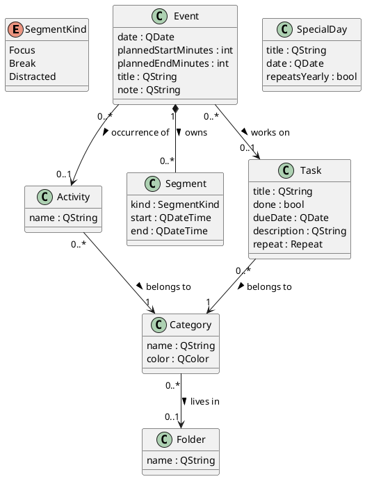

# TickTimer — Design Document

*Status: **v5 — matches the shipped v17 application.** The first two addenda are merged below (§3.9–§3.14); all later addenda remain standalone files and are indexed at the end of §3 — they ARE the decision log's continuation, kept as records of the sessions that produced them, not drafts awaiting merge. Two of them (`login`, `sync`) mark a turn: TickTimer grew from a purely local desktop app into a **client + self-hosted server** pair. Formerly "Time & Focus Tracker."*
*Last updated: 2026-07-05*

---

## 1. Overview

**What it is.** A desktop application (C++17 / Qt 6) that tracks how you spend the hours of your day on a daily calendar, then shows you where your time actually goes — across work, health, social life, rest, and the time lost to anxiety-driven procrastination. Around that core it keeps your one-off **tasks** (with due dates and an Upcoming view), your life areas organised into **folders**, and the **special days** you're counting down to.

**Who it's for.** A single user (you). No accounts, no multi-user, no sync.

**Why it exists.** Two ideas drive the entire design:

1. **Plan vs. actual.** You plan the day by dropping activities onto the calendar, then track what *really* happened with a focus/break timer inside each block. The gap between the two is where procrastination hides.
2. **Productivity has many dimensions.** Time isn't simply "productive" or "wasted." The gym, friends, and family are valuable in *different areas of life*. The app credits them instead of shaming them.

## 2. Domain model

The shared vocabulary — the real-world concepts, described before any thought of windows or files (Larman, *Applying UML and Patterns*, ch. 9).

**The concepts** (full data-dictionary detail in the Glossary, 04):

- **Category** — a *life area* (Work/Study, Health, …); optionally lives in one **Folder**.
- **Folder** — a named grouping of Categories in the rail; one level deep.
- **Activity** — a reusable *type* of thing you do; belongs to one Category. Never "done."
- **Event** — a block on the calendar: your *intention*. Its identity is any mix of an **Activity** (an occurrence), a linked **Task** (a work block), and/or a free-text **title** (an ad-hoc block; doubles as the block's comments) — the domain refuses to strip the last identity (§3.25–§3.27). Owns its **Segments**.
- **Segment** — one stretch of *real tracked time* (Focus or Break) with real timestamps.
- **Task** — a one-off, *completable obligation* with an optional due date. Belongs to a Category directly.
- **SpecialDay** — a standalone date that matters (birthday, holiday); may repeat yearly.

The type-vs-instance family worth memorising: **Activity** is a reusable *type*; **Event** is a dated *plan* to do one; **Task** is a one-off *obligation* to finish something. Different lifecycles → different concepts. Since v14 an Event may reference an Activity, a Task, both, or neither (title-only); "at least one identity" is the invariant, enforced at the mutation doors rather than in the struct (§3.25).

**Planned times are minutes, not QTime.** Events store `plannedStartMinutes`/`plannedEndMinutes` as ints (minutes after midnight) because the last slot ends exactly at midnight — 1440 — which `QTime` cannot represent. The doc's original QTime sketch met reality and reality won; the intent (a planned time range) is unchanged.

**Deliberately *not* modeled** (derived, or belonging elsewhere): no `Day`, no `WeeklySummary`/`MonthlySummary`, no stored "upcoming" list, no stored "next occurrence" for special days, no timer-state classes. Every one of those is derived on demand (§3.5) or is runtime state (§3.8).

## 3. Key design decisions

Each is **choice → why → alternative rejected**.

**3.1 Half-hour planning slots, 6 AM–midnight.**
The day is planned in **30-minute slots** from 6 AM to midnight (36 slots); a block spans 1–4 slots (30 min–2 h).
*Why:* validated by the interactive prototype — the original hourly sketch proved too coarse in use. When a validated prototype and a document disagree, reality wins and the document is corrected (this correction, right here).
*Rejected:* hourly slots (too coarse); free-form intervals for *planning* (complexity without payoff at the planning stage).

**3.2 Plan vs. actual, kept separate (Event vs. Segment).**
*Why:* the gap between intention and reality is the whole point. **3.3** Planning is coarse; the timer measures to the second — easy entry where entry matters, truth where truth lives. **3.4 Reference, don't copy** (Event → Activity → Category; Task → Category; Category → Folder): one source of truth; rename or recolour once and everything follows. **3.5 Derive, don't store:** summaries, the Upcoming list, and special-day countdowns are computed from raw data whenever asked; a stored answer can drift and lie. **3.6** Category is a user-definable class, not an enum. **3.7** One Category per Activity (v1). **3.8** Timer state is a state field, not subclasses (Larman ch. 32).

**3.9 Task as its own class, not fields on Activity.** *(merged from addendum #1)*
*Why:* an Activity is a shared *type*; putting `done`/`dueDate` on it fails the two-way test of a domain model — *express every truth, forbid every falsehood*. One shared "Gym" cannot say "Lab 4 done, Lab 5 not," and marking it done would complete every gym block in history.
*Rejected:* `bool done; QDate dueDate;` on `Activity`.

**3.10 Task belongs to a Category directly.** "Lab 4" is not an occurrence of any reusable type. *Rejected:* Task → Activity indirection (forces fake activity types).

**3.11 Optional due date as an invalid QDate.** `!isValid()` **is** the "date TBD" state, first-class. *Rejected:* a parallel `hasDueDate` flag — a second source of truth waiting to disagree.

**3.12 Folder as a stored concept, not a name convention.** *(merged from addendum #2)*
*Why:* folder membership must survive a restart — it is a fact, and facts get concepts. *Rejected:* name-prefix folders ("School / LOG410") — a fact smuggled into a string; and nesting (complexity before need).

**3.13 Upcoming is a query, not a table.** `upcomingTasks()` — undone, dated, most urgent first — recomputed on every change. *Rejected:* persisting the grouped list (§3.5).

**3.14 Yearly special days; the Feb 29 rule.** The *next* occurrence is derived, never stored. A Feb 29 anniversary in a common year resolves to **Mar 1** — arbitrary, documented, decided at design time instead of discovered in production. *Rejected:* storing next-occurrence; vacation date *ranges* (deferred — enter a vacation by its first day).

**3.15–3.34 — the decision log continues in the addenda.** Same
choice → why → rejected format; each file is the record of the session that
produced it:

| Sections | Addendum | Topics |
|---|---|---|
| §3.15–§3.20 | `design-addendum-task-details.md` | Task `description`/`repeat`, `updateTask`, settings vs domain, the due strip, drag-and-drop |
| §3.21–§3.24, §3.35, §3.37–§3.40 | `design-addendum-agenda-and-tracking.md` | Upcoming as cards, week agenda (`AgendaWidget` ×7), drag-to-resize, *Distracted* time — tracked (§3.24) and then made visible everywhere (§3.35) |
| §3.25–§3.29, §3.33–§3.34, §3.36, §3.39 | `design-addendum-block-labels.md` | Event's three identities, task & ad-hoc blocks, linking a task to a block, multiline labels, task + comments coexisting, the task-notes toggle, column-flowed text |
| §3.30–§3.32 | `design-addendum-android.md` | compact mode by geometry, touch scrolling, the minimum-width probe |
| (login A–F) | `design-addendum-login.md` | client/server split, own auth vs Google, salted+stretched passwords, QTcpServer, async client, the three-stacked networking bug |
| (sync A–H) | `design-addendum-sync.md` | full-document sync, the four-row decision table, session tokens, the opaque-blob server, conflict-as-human-choice |
| (accounts A–D) | `design-addendum-accounts.md` | per-account local files, sync-state namespacing, one-time data adoption of the old global planner |
| (share A–H) | `design-addendum-share.md` | directed read grants, 401 vs 403, path parameters, the client-side compare (one summarizer, two datasets), whole-blob privacy trade-off |
| (update A–G) | `design-addendum-update.md` | the notify/download/self-install ladder (and why Level 1), version as single source of truth (the RC_INVOKED trick), strict semver, per-request version.json, the non-nag banner rule as a pure function |

## 4. Data & persistence

**A single, versioned JSON file** (`AppData/Roaming/TickTimer/data.json`), loaded whole at startup, held in memory, written whole on every change.
*Why JSON:* zero setup, human-readable — you can open your own day in a text editor. *Format version:* **6** (v1 → v2 added `tasks`; v2 → v3 added `folders`, `specialDays`, `Category.folderId`; v3 → v4 added `Task.description`/`repeat`; v4 → v5 added the `"distracted"` segment kind; v5 → v6 added `Event.taskId`/`Event.title` — the block-identity fields). Every growth was **additive** — a missing key, *or an unknown enum string,* reads as a safe default, so older files load unchanged with no migration branch. Note: user **preferences** (Pomodoro durations) live in `QSettings`, deliberately *outside* this file — settings and domain data have different lifetimes. *Rejected for now:* SQLite — a planned, deliberate upgrade once data volume makes querying matter. *Since v16:* a second, entirely separate store lives on the server — `accounts.json` (identity: usernames + password hashes) and `planners/<user>.json` (one versioned copy of each account's planner). The server treats a synced planner as an **opaque blob** `{revision, data}` — it never parses planner internals, so the format above can evolve without the server ever changing (`design-addendum-sync` §D). *Since v18:* a third server file, `shares.json` — the directed read grants behind share & compare (`design-addendum-share` §B); permissions, like identity, are the server's data, never the planner's.

**Safe writes.** Every save is atomic write-then-replace (`QSaveFile`): a crash mid-save can never corrupt the existing file.

**Crash insurance for the live timer.** While a timer runs, a small running record ({event, kind, start, lastSeen}) is persisted and refreshed by a **~30-second heartbeat**. On the next launch an orphaned record is converted into a real Segment — at most ~30 s of the in-progress interval is lost. Verified by a simulated-crash test in the automated suite.

**Renames that touch persisted state need a bridge.** The app's rename (TimeFocusTracker → TickTimer) moved the data folder; `migrateLegacyData()` copies (never moves) the legacy file into the new home on first launch.

## 5. Scope

**Shipped (v15):** categories (+ folders, with **drag-and-drop** organising), activities, the 30-minute-slot daily calendar with notes and rescheduling, **drag-to-resize** of event blocks, a **seven-day week agenda** (the day agenda reused ×7), the focus/break timer with crash recovery **plus a third *distracted* time kind**, tasks with due dates/descriptions/repeat and the Upcoming view (cards) with a read-only "due today" strip, special days as countdown cards, daily glance / weekly / monthly reviews, Pomodoro with **adjustable durations** (`QSettings`), **blocks with real identity** — activity occurrences, **task blocks**, and ad-hoc title-only blocks, a task linkable to any existing block, **multiline labels** coexisting with the task line, an optional **task-notes** display (indented description, `QSettings`-backed toggle), **column-flowed** block text (budget-aware: long notes use the empty right half instead of starving neighbours) — an **Android-ready build** with an automatic compact layout (`docs/ANDROID.md`), versioned JSON persistence (**v6**), and — the **networked arc** — a self-hosted **login** gate (own accounts, salted+stretched passwords, no Google), **device sync** of the whole planner through that server (revision-checked, conflicts always a human choice), all riding a small `ticktimer-server` program you run yourself. Test suites now stand at **38 domain + 6 UI + 14 auth + 7 live end-to-end = 65 green**, warning-free; the UI regression suite was born from a real crash and the live suite spawns the actual server over a real socket.

*Decisions for everything past §3.14 are indexed at the end of §3.*

**Explicit non-goals (the current fences — future features, not oversights):**
acting on task `repeat` (regenerate on completion) · splitting *distracted* (procrastination vs doomscrolling…) and *break* (walk, chores…) into labelled subtypes — owner interest noted §3.37, likely the next domain session · tags/reminders on tasks · vacation date *ranges* · folder nesting · special days on the month grid · remembered window/sidebar state (QSettings) · Qt model/view refactor · SQLite · a QML mobile front-end (Widgets runs on Android today; native feel is its own project) · auto-sync (today it's a manual button) · update Level 2 — download-for-you (`design-addendum-update` §G) · per-platform version advertising · totals-only sharing (share numbers without titles — `design-addendum-share` §H) · share *invitations* (needs server-pushed events).

*(Also retired since then: **share & compare planners — done**, `design-addendum-share`. **Update notices — done**, `design-addendum-update` — and with it the networked arc is COMPLETE: login → sync → share & compare → update notices.)*

*(Retired since v11: drag-and-drop into folders — done, right-click kept; a task on the calendar — done twice over, first as the read-only due strip, then as real task blocks; the Android build — done, see `docs/ANDROID.md`; a distracted box in the glance panel — done, plus week/month reviews, §3.35; **desktop↔phone sync — done**, `design-addendum-sync`, on top of a self-hosted **login** system, `design-addendum-login`.)*

## 6. Build order (as it actually happened)

1–5 as originally planned (categories & activities → calendar → persistence → timer → charts/reviews, then Pomodoro & polish), followed by two **unplanned feature iterations** — Tasks & Deadlines, then Folders / Upcoming / Special Days — each entering through a design addendum (classify → document → fence) before any code. The original dependency logic held: nothing later required reworking anything earlier.

Then two more addendum-first waves: **block identity** (§3.25–§3.29, §3.33–§3.34 — labels → task blocks → ad-hoc blocks → linking → multiline → task + comments coexisting → task notes → column flow, several steps owner-driven from real use) and the **Android port** (§3.30–§3.32) — the latter costing **zero domain changes**, the layering's proof-of-work. Along the way the suite gained its first **UI regression tests**, born from a real delete-during-signal crash (`TROUBLESHOOTING.md` tells the story; `tests/test_ui.cpp` keeps it dead).

Then the **networked arc** turned a local app into a client/server pair — **login** (`design-addendum-login`: own accounts, salted+stretched passwords, a hand-rolled `QTcpServer` because the framework module isn't universally present, and a genuinely nasty three-stacked networking bug that only a live client↔server test could catch) and **device sync** (`design-addendum-sync`: full-document sync whose entire brain is a four-row truth table — *server moved? × local changed?* → nothing / push / pull / conflict — with conflicts always handed to a human). Crucially the **planner domain didn't change**: identity and sync bolt in *front of* it, the same proof-of-work the Android port gave. The live test suite now spawns the real server and drives a two-'device' playbook over a socket.

---

*This is a living document. Every change preserves the two core ideas — **plan vs. actual**, and **productivity across many life areas** — and every domain change enters through an addendum first.*
